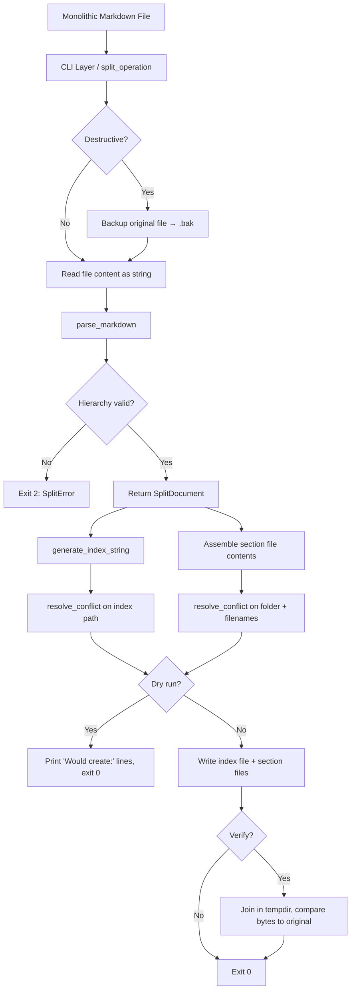
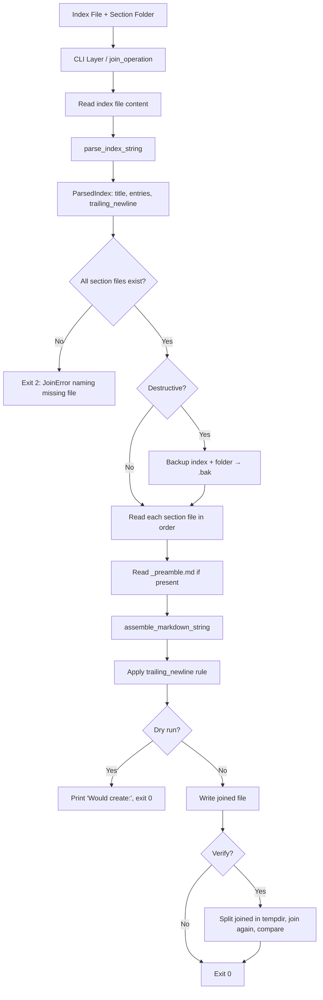
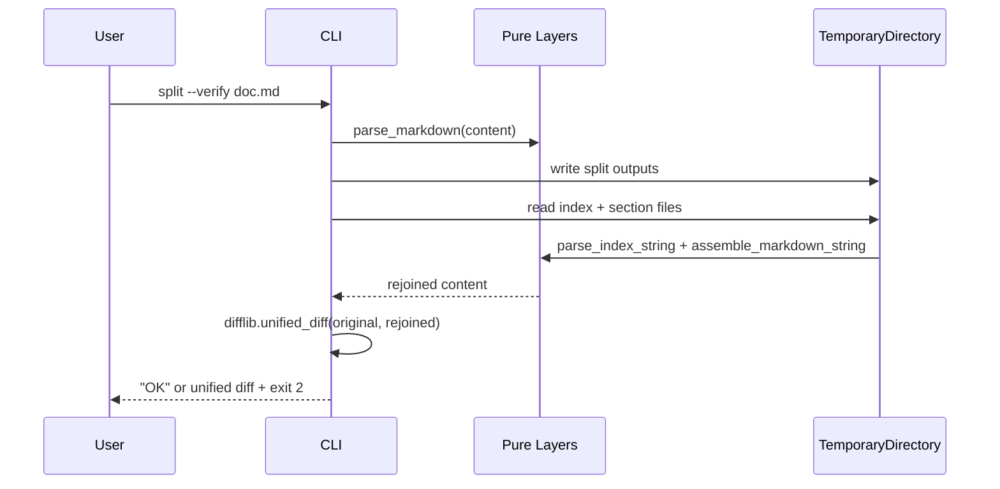

# Technical Design Document — Markdown Splitter

> A merged TDD synthesising the strongest elements of `tdd-zai-glm1.md` (baseline architecture and test plan), `tdd-qoder-glm51.md` (error tables, acceptance criteria, canonical-LF rule), `tdd-qoder-zai-glm51.md` (function reference, line-ending helpers, worked example), and `tdd-gemini.md` (data-flow diagrams). See `tdd-comparison-analysis.md` for the rationale behind each merged element.

## 1. Architecture

### 1.1 Single-File Layout

Everything lives in `mdsplit.py` at the project root. No packages, no submodules, no external dependencies. The file serves as both a CLI tool and an importable library.

```
markdown-splitter/
├── mdsplit.py              # All source code, CLI
├── doc/
│   ├── requirements.md     # Source of truth for behavior
│   └── tdd.md              # This document
└── tests/
    ├── test_parser.py      # Pure parsing (string in, models out)
    ├── test_naming.py      # Filename sanitization + conflict resolution
    ├── test_index.py       # Index render/parse round-trips
    ├── test_io.py          # File-system operations (split, join, backup)
    ├── test_idempotency.py # Byte-identical round-trip verification
    └── test_cli.py         # CLI argument parsing and output formatting
```

Tests live in a separate `tests/` folder so production code ships clean. They import from `mdsplit.py` and use `tempfile` for filesystem tests.

### 1.2 Layered Internal Structure

The single file is organised into strict layers, top to bottom. Higher layers depend on lower layers; lower layers never import from higher.

```
Layer 4: CLI           — argparse, main(), stdout/stderr output
Layer 3: Orchestrators — split_operation(), join_operation()  (combine pure layers + IO)
Layer 2: IO            — read_file(), write_file(), resolve_conflict(), backup_path()
Layer 1: Generator     — generate_index_string(), assemble_markdown_string()
Layer 0: Parser        — parse_markdown(), parse_index_string(), sanitize_filename()
Layer 0: Models        — Section, Preamble, IndexEntry, SplitDocument, ParsedIndex
```

Layers 0 and 1 are **pure functions** — string in, data out, zero side effects. The most complex logic (parsing, whitespace tracking, index formatting) is fully testable without touching the filesystem.

Layer 2 is the only layer that imports `os`, `pathlib`, or `shutil`. This is enforced by import discipline, not just convention.

### 1.3 Dependencies

Python 3.9+ standard library only. No `pip install`.

| Module | Purpose |
|--------|---------|
| `re` | Header detection, description extraction, filename sanitization, index parsing |
| `os` / `shutil` | Backup rename, directory creation |
| `pathlib` | Path manipulation |
| `dataclasses` | Data models |
| `argparse` | CLI |
| `sys` | Exit codes, stderr |
| `tempfile` | `--verify` mode only |
| `difflib` | `--verify` diff output |
| `unittest` | Test framework |
| `typing` | Type hints |

### 1.4 Data Flow — Split Operation



### 1.5 Data Flow — Join Operation



### 1.6 Verify Sequence



---

## 2. Data Models

All models are plain `dataclasses` with no methods. They are the contract between layers.

```python
from dataclasses import dataclass, field
from typing import List, Optional

@dataclass
class Section:
    header_text: str       # Raw header line, e.g. "## Installation Guide"
    body: str              # Everything after the header line, up to next split-level header.
                           # Excludes trailing blank lines (those go into trailing_blanks).
    trailing_blanks: int   # Blank lines between this section and the next.
    description: str       # Auto-extracted description for the index.

@dataclass
class Preamble:
    content: str           # Verbatim preamble (may include front matter; in ## fallback mode,
                           # includes the lone # header line).
    trailing_blanks: int   # Blank lines between preamble end and first section header.

@dataclass
class SplitDocument:
    title: str                       # Derived from first # header (or filename fallback).
    preamble: Optional[Preamble]     # None if no preamble.
    sections: List[Section]
    has_trailing_newline: bool       # State of the original document.
    line_ending: str                 # "\n" or "\r\n".
    split_level: int                 # 1 or 2.

@dataclass
class IndexEntry:
    display_name: str       # Header text with markdown stripped.
    relative_path: str      # e.g. "my-document/installation-guide.md".
    description: str        # Auto-extracted or fallback.
    trailing_blanks: int    # Blank lines after this section in the original.

@dataclass
class ParsedIndex:
    title: str
    entries: List[IndexEntry]
    has_trailing_newline: bool
```

### 2.1 Key design decisions

- **`Section.header_text` is separate from `Section.body`.** This makes "what goes into the section file" unambiguous: `header_text + line_ending + body`. Eliminates a class of "is the header in the file twice / not at all?" bugs.
- **`Preamble` is its own dataclass**, not a string field on `SplitDocument`. The presence-of-preamble check is `if doc.preamble is not None`, never a truthy-string check. Makes the two preamble modes (none / single-`#` fallback) cleanly distinguishable.
- **`trailing_blanks` is stored as an int**, not as trailing whitespace in the body. Each section file ends with exactly one newline; inter-section whitespace lives only in the index. This is the single source of truth for round-trip whitespace.
- **`line_ending` is detected once** at parse time and propagated to every output file. The pure layers always work in `\n`; conversion happens only at the IO boundary (see §5.2).

---

## 3. Parser — Layer 0 (Pure)

Converts a raw markdown string into a `SplitDocument`. The most complex component and the foundation of idempotency.

### 3.1 Line ending detection

```python
def detect_line_ending(text: str) -> str:
```

- If `\r\n` appears anywhere → return `"\r\n"`.
- Otherwise return `"\n"`.
- Called once at the top of `parse_markdown`.

### 3.2 Header detection

```python
HEADER_RE = re.compile(r"^(#{1,6})\s+(.*)$")
```

Matches ATX-style headers (`# Title`, `## Subtitle`, ...). Does **not** match:
- Lines inside fenced code blocks (` ``` ` or `~~~`).
- Lines inside indented code blocks (4+ leading spaces). *(MVP: out of scope — flagged in §13.)*
- Setext-style headers (underlines with `===` or `---`).

Code-fence tracking is a state variable toggled by lines matching `^(```|~~~)`. The exact fence sequence is stored to handle nested fences of different types.

### 3.3 Split level resolution

```python
def resolve_split_level(lines: List[str]) -> int:
```

**Pass 1 — count `#` headers** (ignoring those inside code blocks):
- Count > 1 → split level = 1.
- Count == 1 → split level = 2.
- Count == 0 *and* any other-level header exists → split level = 2 (treats `##` as top-level, no preamble).
- Count == 0 *and* no headers at all → raise `SplitError("No markdown headers found. Cannot split.")`.

**Pass 2 — validate header order**:
- When splitting on level 1: any level-2+ header that appears before the first `#` raises `SplitError("Header hierarchy is inconsistent — a deeper header appears before the first split-level header.")`.
- When splitting on level 2: any level-3+ header before the first `##` raises the same error. A single `#` header before the first `##` is expected (it becomes preamble) and is **not** an error.

### 3.4 Section chunking

```python
def chunk_sections(
    lines: List[str], split_level: int
) -> Tuple[Optional[Preamble], List[Section]]:
```

1. Walk lines top-to-bottom, tracking code-block state.
2. Lines before the first split-level header → preamble.
3. On each split-level header:
   - Finalise the previous section: strip trailing blank lines from its body, count them as that section's `trailing_blanks`.
   - Start a new section with this header line.
4. Non-header lines (and deeper headers) → current section's body.
5. After all lines, finalise the last section. Its `trailing_blanks` is always 0 — trailing whitespace at EOF belongs to the trailing-newline state, not to inter-section spacing.
6. Compute the preamble's `trailing_blanks` (blank lines between end of preamble and first section header).

**Single-`#` fallback exception**: in `split_level == 2` mode, the lone `#` header line and all content between it and the first `##` are *part of the preamble*. The preamble file therefore starts with the `#` header line. In `split_level == 1` mode, the preamble has no header line at all.

### 3.5 Description extraction

```python
def extract_description(header_text: str, body: str) -> str:
```

Per the requirements' priority order:

1. Walk body lines, skipping blank lines.
2. Skip structural elements:
   - Fenced code blocks (` ``` ` / `~~~`)
   - Tables (lines matching `^\|`)
   - Images (`^\s*!\[`)
   - Blockquotes (`^\s*>`)
   - Nested headers (`^#{2,6}\s`)
3. The first non-empty, non-structural line is the candidate.
4. Strip inline markdown via `strip_markdown_inline`:
   - `**bold**` / `__bold__` → `bold`
   - `*italic*` / `_italic_` → `italic`
   - `` `code` `` → `code`
   - `[text](url)` → `text`
   - `` → `alt`
   - `~~strikethrough~~` → `strikethrough`
5. **Fallback resolution** (important — the existing TDDs disagreed here):
   - Body is empty (no non-blank lines at all) → return `"(empty section)"`.
   - Body has content but only structural elements (e.g. only nested sub-headers) → return `f"({header_display_name})"` where `header_display_name` is the header text with `#` marks and whitespace stripped.
6. Truncate at 200 characters; append `...` if truncated.

### 3.6 Top-level `parse_markdown`

```python
def parse_markdown(content: str, filename: str = "") -> SplitDocument:
```

1. `line_ending = detect_line_ending(content)`
2. Normalise: `content = content.replace("\r\n", "\n")`
3. `lines = content.split("\n")`
4. `has_trailing_newline = content.endswith("\n")` — if true, `lines` has a final empty string from the split; remove it but record the state.
5. `resolve_split_level(lines)` → may raise `SplitError`.
6. `chunk_sections(lines, split_level)` → `(preamble, sections)`.
7. For each section: `section.description = extract_description(section.header_text, section.body)`.
8. Title derivation:
   - `split_level == 1`: title = first `#` header text.
   - `split_level == 2`: title = lone `#` header text (extracted from preamble).
   - No `#` at all (zero-`#`-but-has-`##` mode): title = `filename` stem.
9. Return `SplitDocument(...)`.

---

## 4. Generator — Layer 1 (Pure)

Converts `SplitDocument` models back into strings. The inverse of the parser.

### 4.1 Filename sanitization

```python
def sanitize_filename(header_text: str) -> str:
```

Applied per the requirements (in order):

1. Strip `#` marks and following whitespace: `re.sub(r"^#+\s+", "", header_text)`.
2. Strip inline markdown (`**bold**` → `bold`, `[text](url)` → `text`, etc.).
3. Lowercase.
4. Replace spaces and underscores with hyphens.
5. Remove all characters except `a-z`, `0-9`, hyphens.
6. Collapse consecutive hyphens.
7. Strip leading and trailing hyphens.
8. If empty → `"section"`.
9. Append `.md`.

Examples:

| Input | Output |
|---|---|
| `"## Installation Guide"` | `"installation-guide.md"` |
| `"# API / Endpoints (v2)"` | `"api-endpoints-v2.md"` |
| `"## Step_1"` | `"step-1.md"` |
| `"## $$$"` | `"section.md"` |
| `"## Café Résumé"` | `"caf-rsum.md"` *(Unicode stripped — see §13)* |

### 4.2 Filename deduplication within a folder

```python
def deduplicate_filenames(names: List[str]) -> List[str]:
```

If a sanitised name repeats, append `-2`, `-3`, … to subsequent occurrences. The first occurrence keeps the unsuffixed name. Starting at `2` (not `1`) avoids confusion with the unsuffixed first instance.

Example: `["intro.md", "setup.md", "intro.md"]` → `["intro.md", "setup.md", "intro-2.md"]`.

### 4.3 Index generation

```python
def generate_index_string(
    doc: SplitDocument,
    folder_name: str,
    section_filenames: List[str],
) -> str:
```

Output format:

```markdown
# <title>

<!-- mdsplit-index -->
| Section | Description |
|---------|-------------|
| [Preamble](<folder>/_preamble.md) | Preamble <!-- blanks:1 --> |
| [Section Name](<folder>/section-name.md) | Description text <!-- blanks:2 --> |
| [Another](<folder>/another.md) | (empty section) |
<!-- /mdsplit-index -->

<!-- trailing-newline:true -->
```

Construction rules:

1. Title line: `# <doc.title>`.
2. Blank line.
3. Opening marker: `<!-- mdsplit-index -->`.
4. If `doc.preamble is not None`: preamble entry first. Display name is `"Preamble"`, description is `"Preamble"`, `<!-- blanks:N -->` from `preamble.trailing_blanks`.
5. For each section:
   - Display name: header text with `#` marks stripped and whitespace trimmed (markdown formatting also stripped).
   - Relative path: `f"{folder_name}/{section_filenames[i]}"`.
   - Description: from `section.description`.
   - `<!-- blanks:N -->` appended only if `trailing_blanks > 0`.
6. Closing marker: `<!-- /mdsplit-index -->`.
7. Blank line.
8. Trailing-newline marker: `<!-- trailing-newline:{str(doc.has_trailing_newline).lower()} -->`.
9. All line separators use `doc.line_ending`. The index file always ends with a trailing newline.

### 4.4 Index parsing

```python
def parse_index_string(content: str) -> ParsedIndex:
```

The inverse of `generate_index_string`.

1. Extract title from the first `^#\s+(.+)$` line.
2. Find content between `<!-- mdsplit-index -->` and `<!-- /mdsplit-index -->`.
3. If markers missing → raise `JoinError("Index file is missing required mdsplit-index markers")`.
4. Parse each table row (skip the header row `| Section | Description |` and separator row `|---------|-------------|`):

   ```python
   ENTRY_RE = re.compile(
       r"^\|\s*"                                    # leading pipe
       r"\[(.+?)\]"                                 # display_name in brackets
       r"\((.+?)\)"                                 # relative_path in parens
       r"\s*\|\s*"                                  # column separator
       r"(.+?)"                                     # description
       r"(?:\s+<!--\s*blanks:(\d+)\s*-->)?"         # optional blanks
       r"\s*\|$"                                    # trailing pipe
   )
   ```

5. Find `<!-- trailing-newline:(true|false) -->` after the closing marker; default to `True` if missing.
6. Content outside the markers is ignored (allows user freeform notes).

### 4.5 Markdown assembly

```python
def assemble_markdown_string(
    preamble_content: Optional[str],
    preamble_blanks: int,
    section_contents: List[str],
    blanks: List[int],
    has_trailing_newline: bool,
    line_ending: str,
) -> str:
```

`section_contents[i]` is the raw content of section file *i* (header line included, exactly one trailing newline that came from the file).

Algorithm:

1. `parts: List[str] = []`
2. If `preamble_content is not None`:
   - Strip exactly one trailing newline from `preamble_content`.
   - Append to `parts`.
   - Append `preamble_blanks` empty strings (each becomes a blank line on join).
3. For each `(content, trailing_blanks)` in `zip(section_contents, blanks)`:
   - Strip exactly one trailing newline.
   - Append to `parts`.
   - If not the last section: append `trailing_blanks` empty strings.
4. `result = line_ending.join(parts)`
5. If `has_trailing_newline` and not `result.endswith(line_ending)`: `result += line_ending`.
6. If not `has_trailing_newline` and `result.endswith(line_ending)`: strip the trailing line ending.
7. Return `result`.

The "append N empty strings then join with line_ending" pattern is what produces N blank lines between sections.

### 4.6 Section file content

Each section file is written as:

```
<header_text><line_ending><body><line_ending>
```

- Trailing blanks from the original document are **not** in the section file — they live in the index `<!-- blanks:N -->` metadata.
- The preamble file follows the same pattern but has no synthetic header (in `split_level == 2` mode, the preamble content already starts with the `#` header — that's part of the content, not a synthetic boundary).

---

## 5. IO Layer — Layer 2 (Side Effects)

The only layer that imports `os`, `pathlib`, or `shutil`. Kept thin: it moves bytes between disk and the pure layers.

### 5.1 File reading and writing

```python
def read_file(path: Path) -> str:
    """Read UTF-8 file content. Returns content with original line endings preserved."""

def write_file(path: Path, content: str) -> None:
    """Write content as UTF-8. Creates parent directories. Content already has correct line endings."""
```

### 5.2 Line-ending helpers

The pure layers always work in `\n`. Conversion happens only at the IO boundary.

```python
def normalize_to_lf(text: str) -> str:
    """Convert CRLF to LF. Called immediately after read_file."""
    return text.replace("\r\n", "\n")

def apply_line_ending(text: str, line_ending: str) -> str:
    """Convert LF to target line ending. Called immediately before write_file."""
    if line_ending == "\r\n":
        return text.replace("\n", "\r\n")
    return text
```

**Rule:** No function except `read_file` and `write_file` (and these helpers) ever sees `\r\n`. This eliminates a class of CRLF bugs by construction.

### 5.3 Conflict resolution

```python
def resolve_conflict(base_path: Path) -> Path:
```

If `base_path` exists, append `-2`, `-3`, … until a non-existent path is found.

- Files: insert before the suffix. `design-index.md` → `design-2-index.md`.
- Folders: append to folder name. `design/` → `design-2/`.

The split orchestrator applies this to the index file path *and* the section folder path independently. If the index name is mangled to `-2`, the folder name is mangled to match (so they stay paired).

### 5.4 Backup (destructive mode)

```python
def backup_path(target: Path) -> Path:
```

1. Backup name: `target.name + ".bak"` (so `doc.md` → `doc.md.bak`, `doc/` → `doc.bak/`).
2. If backup exists, append `.1`, `.2`, … (`doc.md.bak.1`).
3. `os.rename(target, backup)`.
4. Return the backup path.

Caller catches `OSError` (permissions, cross-device).

### 5.5 Verify support

```python
def diff_strings(expected: str, actual: str, label_a: str, label_b: str) -> str:
    """Produce a unified diff suitable for stdout. Empty string if identical."""
    if expected == actual:
        return ""
    return "".join(difflib.unified_diff(
        expected.splitlines(keepends=True),
        actual.splitlines(keepends=True),
        fromfile=label_a, tofile=label_b, n=3,
    ))
```

This standardises the verify diff format across split-verify and join-verify.

---

## 6. Orchestrators — Layer 3

Compose pure layers with IO to implement the two operations.

### 6.1 Custom errors

```python
class MdsplitError(Exception):
    """Base error."""

class SplitError(MdsplitError):
    """Raised by parser for validation failures."""

class JoinError(MdsplitError):
    """Raised by join for missing files / malformed index."""
```

Caught by the CLI layer; printed to stderr with `Error: ` prefix; exit code 2.

### 6.2 Split operation

```python
def split_operation(
    input_file: Path,
    destructive: bool = False,
    dry_run: bool = False,
    verify: bool = False,
    output: Optional[Path] = None,
) -> int:
```

1. **Read**: `raw = read_file(input_file)`.
2. **Parse**: `doc = parse_markdown(normalize_to_lf(raw), input_file.stem)` → may raise.
3. **Determine output paths**:
   - Base name: `output.stem` if `output` provided, else `input_file.stem`. (See §13 for `--output` semantics.)
   - Index path: `<parent>/<base>-index.md`.
   - Folder path: `<parent>/<base>/`.
4. **Conflict resolution** (non-destructive only):
   - `index_path = resolve_conflict(index_path)`.
   - `folder_path = resolve_conflict(folder_path)`.
   - If either was renamed, derive a *paired* base name from the renamed index (so both index and folder get the same `-2` suffix).
5. **Section filenames**: `[sanitize_filename(s.header_text) for s in doc.sections]` then `deduplicate_filenames(...)`.
6. **If `destructive`**: `backup_path(input_file)` → print `Backup: <path>`.
7. **Generate index**: `index_str = generate_index_string(doc, folder_path.name, filenames)`.
8. **Build section file contents** (each `header_text + "\n" + body + "\n"`).
9. **If `dry_run`**: print `Would create: <each path>` and return 0.
10. **Write**:
    - Create folder.
    - Write index file (`apply_line_ending(index_str, doc.line_ending)`).
    - Write preamble file if `doc.preamble`.
    - Write each section file.
    - Print `Created: <each path>`.
11. **If `verify`**:
    - Inside `tempfile.TemporaryDirectory()`: run `join_operation` on the just-written index, get rejoined content.
    - `diff = diff_strings(raw, rejoined, "original", "rejoined")`.
    - If diff non-empty: print diff, return 2.
12. Return 0.

### 6.3 Join operation

```python
def join_operation(
    index_file: Path,
    destructive: bool = False,
    dry_run: bool = False,
    verify: bool = False,
    output: Optional[Path] = None,
) -> int:
```

1. **Read**: `raw_index = read_file(index_file)`; `index_text = normalize_to_lf(raw_index)`.
2. **Parse**: `parsed = parse_index_string(index_text)` → may raise `JoinError`.
3. **Detect line ending**: `line_ending = detect_line_ending(raw_index)`.
4. **Resolve section paths**: each `entry.relative_path` is resolved against `index_file.parent`. (See §13 for path-resolution rules.)
5. **Validate**: every referenced section file must exist. Missing file → `JoinError(f"Section file not found: {path}")` → exit 2.
6. **Determine output path**:
   - Base name: `output.stem` if provided, else `index_file.stem` with `-index` suffix stripped.
   - Output path: `<parent>/<base>-joined.md`.
   - If not destructive: `resolve_conflict(output_path)`.
7. **If `destructive`**: `backup_path(index_file)` and `backup_path(folder)` → print `Backup:` lines.
8. **Read content**:
   - `preamble_content`: read `_preamble.md` if its entry is present, else `None`.
   - `section_contents`: read each non-preamble entry's file, in order.
   - Track `preamble_blanks` and `blanks: List[int]` from the parsed entries.
9. **Assemble**: `joined_lf = assemble_markdown_string(...)`.
10. **Apply line ending**: `joined = apply_line_ending(joined_lf, line_ending)`.
11. **If `dry_run`**: print `Would create: <output>` and return 0.
12. **Write**: `write_file(output_path, joined)`. Print `Created: <path>`.
13. **If `verify`**:
    - Inside `tempfile.TemporaryDirectory()`: split the joined output, then join the split, get `rejoined`.
    - `diff = diff_strings(joined, rejoined, "first-join", "second-join")`.
    - If diff non-empty: print diff, return 2.
14. Return 0.

---

## 7. CLI Layer — Layer 4

### 7.1 Argument parser

```
mdsplit split <file>       [--destructive] [--dry-run] [--verify] [--output PATH]
mdsplit join  <index-file> [--destructive] [--dry-run] [--verify] [--output PATH]
mdsplit --version
mdsplit --help
```

### 7.2 Main entry point

```python
def main(argv: Optional[List[str]] = None) -> int:
    parser = build_parser()
    args = parser.parse_args(argv)
    try:
        if args.command == "split":
            return split_operation(Path(args.file), ...)
        elif args.command == "join":
            return join_operation(Path(args.index_file), ...)
    except SplitError as e:
        print(f"Error: {e}", file=sys.stderr); return 2
    except JoinError as e:
        print(f"Error: {e}", file=sys.stderr); return 2
    except FileNotFoundError as e:
        print(f"Error: {e}", file=sys.stderr); return 1
    except PermissionError as e:
        print(f"Error: {e}", file=sys.stderr); return 1

if __name__ == "__main__":
    sys.exit(main())
```

### 7.3 Output format

| Situation | Stream | Prefix | Example |
|---|---|---|---|
| File created | stdout | `Created: ` | `Created: design-index.md` |
| File backed up | stdout | `Backup: ` | `Backup: design.md.bak` |
| Dry-run create | stdout | `Would create: ` | `Would create: design-index.md` |
| Dry-run backup | stdout | `Would backup: ` | `Would backup: design.md.bak` |
| Error | stderr | `Error: ` | `Error: No markdown headers found. Cannot split.` |
| Verify diff | stdout | (raw `unified_diff`) | `--- original\n+++ rejoined\n@@ ...` |

### 7.4 Exit codes

| Code | Meaning |
|---|---|
| 0 | Success |
| 1 | General error (file not found, permission denied) |
| 2 | Validation error (no headers, malformed index, missing section files, verify mismatch) |

---

## 8. Function Reference

Single-screen index of every function in the system.

| Function | Layer | Signature | Purpose |
|---|---|---|---|
| `detect_line_ending` | 0 | `(text: str) -> str` | `'\n'` or `'\r\n'` |
| `normalize_to_lf` | 2 | `(text: str) -> str` | CRLF → LF |
| `apply_line_ending` | 2 | `(text: str, le: str) -> str` | LF → target |
| `parse_header` | 0 | `(line: str) -> Optional[Tuple[int, str]]` | `(level, text)` or `None` |
| `resolve_split_level` | 0 | `(lines: List[str]) -> int` | 1 or 2; raises |
| `validate_hierarchy` | 0 | `(lines: List[str], level: int) -> None` | Raises on violation |
| `chunk_sections` | 0 | `(lines: List[str], level: int) -> Tuple[Optional[Preamble], List[Section]]` | Section/preamble split |
| `strip_markdown_inline` | 0 | `(text: str) -> str` | Strip bold/italic/code/links |
| `extract_description` | 0 | `(header_text: str, body: str) -> str` | Description per priority order |
| `parse_markdown` | 0 | `(content: str, filename: str = "") -> SplitDocument` | Top-level parse |
| `sanitize_filename` | 1 | `(header_text: str) -> str` | Safe filename + `.md` |
| `deduplicate_filenames` | 1 | `(names: List[str]) -> List[str]` | Append `-2`, `-3` to dupes |
| `generate_index_string` | 1 | `(doc, folder_name, filenames) -> str` | Index file content |
| `parse_index_string` | 1 | `(content: str) -> ParsedIndex` | Index → entries |
| `assemble_markdown_string` | 1 | `(preamble, p_blanks, contents, blanks, trailing_nl, le) -> str` | Joined doc |
| `read_file` | 2 | `(path: Path) -> str` | UTF-8 read |
| `write_file` | 2 | `(path: Path, content: str) -> None` | UTF-8 write + mkdir |
| `resolve_conflict` | 2 | `(base_path: Path) -> Path` | Append `-2`/`-3` if exists |
| `backup_path` | 2 | `(target: Path) -> Path` | Rename to `.bak` |
| `diff_strings` | 2 | `(a, b, label_a, label_b) -> str` | Unified diff |
| `split_operation` | 3 | `(file, **opts) -> int` | Exit code |
| `join_operation` | 3 | `(index, **opts) -> int` | Exit code |
| `build_parser` | 4 | `() -> argparse.ArgumentParser` | CLI parser |
| `main` | 4 | `(argv=None) -> int` | Entry point |

---

## 9. Idempotency Mechanics

The single most important mechanism. Get this wrong and round-trips fail.

### 9.1 The three pieces of state

To round-trip a document byte-for-byte, the index must record three pieces of metadata that would otherwise be lost when sections are sliced into separate files:

1. **`<!-- blanks:N -->`** on each entry — the number of blank lines between this section and the next.
2. **`<!-- trailing-newline:true|false -->`** at the end of the index — whether the original ended with a newline.
3. **Line ending style** — detected from the index file content at join time and applied to the output.

### 9.2 Blank line accounting during split

For a section spanning lines `[start, end)` in the original document, where the *next* section starts at `end`:

```python
def count_trailing_blanks(lines: List[str], start: int, end: int) -> Tuple[int, int]:
    """Count blank lines at the end of lines[start:end]. Return (count, trimmed_end)."""
    count = 0
    i = end - 1
    while i >= start and lines[i].strip() == "":
        count += 1
        i -= 1
    return count, i + 1
```

Body lines: `lines[start + 1 : trimmed_end]` (excludes the header line and the trailing blanks).
Trailing blanks count: stored as `section.trailing_blanks`, eventually surfaces as `<!-- blanks:N -->` in the index.

**Last-section rule**: the last section's `trailing_blanks` is always 0. Trailing blank lines at end of file are owned by the `has_trailing_newline` flag and the file's final newline state, not by inter-section spacing.

### 9.3 Blank line accounting during join

```
for i, (content, blanks) in enumerate(zip(section_contents, blanks_list)):
    output.append(content.rstrip(line_ending))   # strip exactly one trailing newline
    if i < len(section_contents) - 1:
        for _ in range(blanks):
            output.append("")                     # produces a blank line on join
joined = line_ending.join(output)
if has_trailing_newline:
    joined += line_ending
```

### 9.4 Worked example (byte-level)

Original file bytes:
```
# Section A\n
Content A\n
\n
\n
# Section B\n
Content B\n
```

(That's 6 newlines, document ends with `\n`, so `has_trailing_newline = True`.)

**After split:**

`a.md` (file content, ending with exactly one `\n`):
```
# Section A
Content A
```

`b.md`:
```
# Section B
Content B
```

Index:
```markdown
# Section A

<!-- mdsplit-index -->
| Section | Description |
|---------|-------------|
| [Section A](doc/a.md) | Content A <!-- blanks:2 --> |
| [Section B](doc/b.md) | Content B |
<!-- /mdsplit-index -->

<!-- trailing-newline:true -->
```

**During join:**

```
content_a.rstrip("\n") = "# Section A\nContent A"
content_b.rstrip("\n") = "# Section B\nContent B"

parts = [
    "# Section A\nContent A",   # section A
    "",                          # blank #1 (from blanks:2)
    "",                          # blank #2
    "# Section B\nContent B",   # section B
]
joined = "\n".join(parts)
# = "# Section A\nContent A\n\n\n# Section B\nContent B"

has_trailing_newline → joined += "\n"
# = "# Section A\nContent A\n\n\n# Section B\nContent B\n"
```

This matches the original byte-for-byte. ✓

---

## 10. Error Handling

### 10.1 Error → message → exit code

| Condition | Message | Exit |
|---|---|---|
| File not found | `Error: File not found: <path>` | 1 |
| Cannot read file | `Error: Cannot read file: <path>` | 1 |
| Permission denied on write | `Error: Permission denied: <path>` | 1 |
| No headers | `Error: No markdown headers found. Cannot split.` | 2 |
| Bad header hierarchy | `Error: Header hierarchy is inconsistent — a deeper header appears before the first split-level header.` | 2 |
| Single `#` with no `##` | `Error: Document has only one section; nothing to split.` | 2 |
| Missing index markers | `Error: Index file is missing required mdsplit-index markers.` | 2 |
| Missing section file | `Error: Section file not found: <path>` | 2 |
| Verify mismatch | `Error: Round-trip verification failed — output differs from original.` *(followed by unified diff on stdout)* | 2 |

All error messages go to stderr with the `Error: ` prefix. Verify diff goes to stdout.

---

## 11. TDD Plan

Each phase: **write failing tests → minimum implementation → refactor**. No code without a failing test.

### Phase 1 — Parser: header detection & validation (`tests/test_parser.py`)

| Test | Input | Expected |
|---|---|---|
| `test_multiple_h1_split_on_h1` | Two `#` headers | `split_level == 1` |
| `test_single_h1_split_on_h2` | One `#`, multiple `##` | `split_level == 2` |
| `test_zero_h1_with_h2` | Only `##` headers | `split_level == 2`, no preamble |
| `test_no_headers_error` | Plain text | Raises `SplitError` |
| `test_single_h1_no_h2_error` | One `#`, no `##` | Raises `SplitError` |
| `test_h2_before_h1_error` | `## Sub` then `# Main` | Raises `SplitError` |
| `test_h3_before_h2_error` | `# T\n### Deep\n## S` | Raises `SplitError` |
| `test_non_contiguous_ok` | `# A\n### Jump\n## S` *(if split_level==1)* | Valid |
| `test_header_inside_codeblock_ignored` | ` ``` \n# Fake\n ``` \n# Real` | Only `# Real` detected |

### Phase 2 — Parser: chunking & whitespace

| Test | Input | Expected |
|---|---|---|
| `test_basic_two_sections` | `# A\nText A\n# B\nText B` | 2 sections, bodies correct |
| `test_nested_headers_in_body` | `# A\n## Nested\nText\n# B` | `## Nested` inside section A |
| `test_trailing_blanks_counted` | `# A\nText\n\n\n# B` | Section A `trailing_blanks == 2` |
| `test_last_section_trailing_blanks_zero` | `# A\nText\n# B\nText\n\n\n` | Section B `trailing_blanks == 0` |
| `test_empty_section` | `# A\n\n# B` | Section A body is empty |
| `test_preamble_captured` | `Intro\n# A\nText` | Preamble = `"Intro"` |
| `test_no_preamble` | `# A\nText` | `preamble is None` |
| `test_preamble_with_front_matter` | `---\nyaml: true\n---\nIntro\n# A` | Preamble includes front matter + intro |
| `test_single_h1_preamble_includes_title` | `# Doc\nIntro\n## A\nText` | Preamble = `"# Doc\nIntro"`, one section on `##` |
| `test_crlf_preserved` | Content with `\r\n` | `line_ending == "\r\n"` |
| `test_trailing_newline_true` | `"# A\nText\n"` | `has_trailing_newline == True` |
| `test_trailing_newline_false` | `"# A\nText"` | `has_trailing_newline == False` |

### Phase 3 — Parser: description extraction

| Test | Body | Expected |
|---|---|---|
| `test_plain_text` | `"First line\nSecond"` | `"First line"` |
| `test_bold_stripped` | `"**Bold** text"` | `"Bold text"` |
| `test_link_stripped` | `"See [docs](url)"` | `"See docs"` |
| `test_code_stripped` | `` "Use `foo`" `` | `"Use foo"` |
| `test_code_block_skipped` | `" ``` \ncode\n ``` \nReal desc"` | `"Real desc"` |
| `test_table_skipped` | `"| A | B |\n|---|---|\nDesc"` | `"Desc"` |
| `test_image_skipped` | `"\nCaption"` | `"Caption"` |
| `test_blockquote_skipped` | `"> Quote\nActual"` | `"Actual"` |
| `test_empty_body_fallback` | `""` | `"(empty section)"` |
| `test_only_nested_headers_fallback` | `"### Sub\n### Sub2"` (header text "Main") | `"(Main)"` |
| `test_truncation` | 300-char line | First 200 chars + `"..."` |

### Phase 4 — Generator: filename sanitization (`tests/test_naming.py`)

| Test | Input | Expected |
|---|---|---|
| `test_basic` | `"## Installation Guide"` | `"installation-guide.md"` |
| `test_special_chars` | `"# API / Endpoints (v2)"` | `"api-endpoints-v2.md"` |
| `test_underscores` | `"## Step_1"` | `"step-1.md"` |
| `test_empty_result` | `"## $$$"` | `"section.md"` |
| `test_unicode_removed` | `"## Café Résumé"` | `"caf-rsum.md"` |
| `test_consecutive_hyphens` | `"# A -- B"` | `"a-b.md"` |
| `test_leading_trailing_hyphens` | `"# -Leading-"` | `"leading.md"` |
| `test_inline_markdown_stripped` | `"## **Bold** Title"` | `"bold-title.md"` |
| `test_dedup_appends_2` | `["a.md", "a.md"]` | `["a.md", "a-2.md"]` |
| `test_dedup_triple` | `["a.md", "a.md", "a.md"]` | `["a.md", "a-2.md", "a-3.md"]` |

### Phase 5 — Generator: index format (`tests/test_index.py`)

| Test | Validates |
|---|---|
| `test_index_has_markers` | `<!-- mdsplit-index -->` and `<!-- /mdsplit-index -->` present |
| `test_index_has_title` | First line is `# <title>` |
| `test_preamble_entry_first` | Preamble entry appears before all sections |
| `test_blanks_metadata` | `<!-- blanks:N -->` appended where N > 0 |
| `test_no_blanks_when_zero` | No `<!-- blanks:0 -->` in output |
| `test_trailing_newline_marker_true` | `<!-- trailing-newline:true -->` present |
| `test_trailing_newline_marker_false` | `<!-- trailing-newline:false -->` present |
| `test_entry_format` | Each entry matches `| [Name](path) | desc <!-- blanks:N --> |` |
| `test_relative_paths_include_folder` | Paths are `folder/file.md` |

### Phase 6 — Generator: index parse round-trip

| Test | Validates |
|---|---|
| `test_generate_then_parse` | All fields recovered |
| `test_parse_preserves_order` | Entries returned in same order |
| `test_parse_extracts_blanks` | Blank counts match |
| `test_parse_extracts_trailing_newline` | Boolean matches |
| `test_parse_ignores_extra_content` | Lines outside markers don't break parsing |
| `test_parse_missing_markers_error` | Raises `JoinError` |
| `test_parse_default_blanks_zero` | Entry without `<!-- blanks:N -->` → `trailing_blanks == 0` |

### Phase 7 — Generator: assembly

| Test | Setup | Expected |
|---|---|---|
| `test_assemble_basic` | 2 sections, no blanks between | `"# A\nText A\n# B\nText B"` |
| `test_assemble_with_blanks` | Sections with `trailing_blanks == 2` | 2 blank lines inserted |
| `test_assemble_with_preamble` | Preamble + 1 section | Preamble first |
| `test_assemble_trailing_newline_true` | flag = True | Output ends with `\n` |
| `test_assemble_trailing_newline_false` | flag = False | Output does not end with `\n` |
| `test_assemble_crlf` | `line_ending = "\r\n"` | All separators are `\r\n` |

### Phase 8 — IO: conflict resolution & backup (`tests/test_io.py`)

| Test | Validates |
|---|---|
| `test_no_conflict_returns_same_path` | `resolve_conflict` returns input when no conflict |
| `test_conflict_appends_2` | Returns `path-2` when `path` exists |
| `test_conflict_increments` | Returns `path-3` when `path` and `path-2` exist |
| `test_backup_renames_file` | Original moved to `.bak` |
| `test_backup_increments` | `.bak.1` when `.bak` exists |
| `test_write_creates_parent_dirs` | Nested path creates intermediate directories |
| `test_split_preserves_original_nondestructive` | Original file unchanged after split |
| `test_join_preserves_index_and_sections` | Index + sections unchanged after join |
| `test_destructive_split_creates_bak` | Original renamed to `.bak` in destructive mode |
| `test_destructive_join_backs_up_index_and_folder` | Both index and folder renamed to `.bak` |

### Phase 9 — End-to-end idempotency (`tests/test_idempotency.py`) — **CRITICAL**

Each test: write input to temp file → split → join → assert byte-identical.

| Test | Input characteristic |
|---|---|
| `test_simple_h1_sections` | Two `#` sections with text |
| `test_h2_sections_with_title` | One `#` + multiple `##` |
| `test_with_preamble` | Plain preamble + `#` sections |
| `test_with_front_matter` | YAML front matter + `#` sections |
| `test_empty_sections` | `# A\n\n# B\n\n# C` |
| `test_nested_content` | `# A\n## Sub\n### SubSub\nText\n# B` |
| `test_code_blocks_with_hashes` | `# A\n``` \n# Not a header\n``` \n# B` |
| `test_varying_blank_lines` | 0, 1, 3 blank lines between sections |
| `test_crlf_line_endings` | Entire document uses `\r\n` |
| `test_no_trailing_newline` | Document without final `\n` |
| `test_special_chars_in_headers` | `# A & B\n# C++ / D` |
| `test_duplicate_header_names` | Two `# Introduction` headers |
| `test_multiple_cycles` | Split → join → split → join (3 cycles) all identical |
| `test_preamble_h1_fallback` | `# Title\nIntro\n## A\n## B` |

### Phase 10 — CLI (`tests/test_cli.py`)

| Test | Validates |
|---|---|
| `test_split_command_creates_files` | `split doc.md` produces index + folder |
| `test_join_command_creates_file` | `join doc-index.md` produces joined file |
| `test_dry_run_no_files` | `--dry-run` produces no files on disk |
| `test_dry_run_stdout` | `--dry-run` prints `Would create:` lines |
| `test_verify_flag_success` | `--verify` exits 0 on clean round-trip |
| `test_verify_flag_failure` | Manually corrupted section → `--verify` exits 2 with diff |
| `test_error_no_file` | Missing input → exit code 1 |
| `test_error_no_headers` | File with no headers → exit code 2 + error message |
| `test_error_missing_section` | Join with deleted section → exit code 2 |
| `test_output_flag_split` | `--output custom` writes `custom-index.md` + `custom/` |
| `test_output_flag_join` | `--output custom.md` writes `custom.md` |
| `test_version_flag` | `--version` prints version, exit 0 |

### Phase 11 — Implementation order

```
Phase 1:  Header detection & validation        (parser core)
Phase 2:  Section chunking & whitespace        (parser core)
Phase 3:  Description extraction               (parser core)
Phase 4:  Filename sanitization                (generator)
Phase 5:  Index generation                     (generator)
Phase 6:  Index parse round-trip               (generator)
Phase 7:  Markdown assembly                    (generator)
Phase 8:  IO — conflict resolution & backup    (file system)
Phase 9:  End-to-end idempotency               (integration) — CRITICAL GATE
Phase 10: CLI                                  (interface)
```

Phases 1–7 use only pure functions — no filesystem, no mocking. Phases 8–10 use `tempfile.TemporaryDirectory()`. **Do not advance past Phase 9 until all idempotency tests pass.** Idempotency is non-negotiable; if round-trips don't produce byte-identical output, nothing else matters.

---

## 12. Running Tests

```bash
# All tests
python -m unittest discover tests/

# Single test file
python -m unittest tests.test_parser

# Single test
python -m unittest tests.test_parser.TestParser.test_multiple_h1_split_on_h1

# Verbose
python -m unittest discover tests/ -v
```

No test runner dependency. No pytest. Pure stdlib `unittest`.

---

## 13. Open Decisions Resolved

The four prior TDDs all left these three points under-specified. Decisions made for this implementation:

### 13.1 `--verify` diff format

Use `difflib.unified_diff` with `n=3` lines of context. Diff output goes to **stdout** (the verification result is informational, not an error message). The `Error: Round-trip verification failed` line goes to **stderr**. Exit code is 2.

### 13.2 `--output` semantics for `split`

`--output foo` is interpreted as a **base name**, not a path:
- Index file: `foo-index.md`
- Section folder: `foo/`

Both are placed in `foo`'s parent directory (or current directory if `foo` has no parent).

For `join`, `--output foo.md` is treated as a **full output path** (since join produces a single file). If `foo.md` exists, conflict resolution applies.

### 13.3 Path resolution in the index

Section paths in the index are **always relative to the index file's parent directory**. Resolution: `index_file.parent / entry.relative_path`. The path is interpreted literally — no normalisation, no following symlinks. If the index references `my-doc/intro.md`, the join engine reads exactly `<index_dir>/my-doc/intro.md`.

If the user moves the index file but not the folder (or vice versa), the join fails with `JoinError: Section file not found: <resolved path>`. No attempt is made to "find" the missing folder.

### 13.4 Indented (4-space) code blocks

**Out of scope for MVP.** Header detection only tracks fenced code blocks (` ``` ` and `~~~`). A `#` indented by 4+ spaces will be treated as a header. Documented limitation; flagged in §15.

### 13.5 Unicode in filenames

**Out of scope for MVP.** Sanitization strips non-ASCII characters per the spec's character class (`a-z`, `0-9`, `-`). `Café Résumé` becomes `caf-rsum.md`. A future enhancement could add `unicodedata.normalize("NFKD", ...)` + ASCII transliteration.

---

## 14. Acceptance Criteria

The tool is complete when **all** of the following hold:

1. **All unit tests pass** — every test in §11 passes.
2. **All round-trip tests produce byte-identical output** — Phase 9 covers all document structures listed.
3. **Multi-cycle stability** — three consecutive split-join cycles produce identical output.
4. **CLI works end-to-end** — `mdsplit split doc.md && mdsplit join doc-index.md` produces `doc-joined.md` byte-identical to `doc.md`.
5. **`--verify` catches corruption** — any manual edit to a section file that breaks round-trip is detected and reported with a unified diff.
6. **`--dry-run` makes no filesystem changes** — verified by test.
7. **`--destructive` creates backups** with correct conflict resolution (`.bak.1`, `.bak.2`).
8. **Error messages match §10.1 exactly** and exit codes are correct.
9. **Zero external dependencies** — only stdlib imports.
10. **Works on Python 3.9+** — no `match`/`case`, no `X | Y` union types in runtime code (`from __future__ import annotations` allowed).

---

## 15. Out of Scope for MVP

- Custom naming patterns (`--name-pattern`)
- Section filtering (`--include`, `--exclude`)
- Markdown linting / formatting during split or join
- Other markup formats (reStructuredText, AsciiDoc, …)
- Configuration file support (`.mdsplitrc`)
- Git-aware mode (auto-detect line endings from `.gitattributes`)
- Watch mode (auto-split/join on file change)
- Indented (4-space) code-block awareness in header detection
- Unicode-aware filename transliteration
- `pip install`-able package distribution (future: add `pyproject.toml`)
- Windows-specific path handling (the tool *should* work on Windows because everything goes through `pathlib`, but it is not part of the MVP test matrix)
- Setext-style headers (`===` / `---` underlines)
- A separate `Verifier` component that diffs `SplitDocument` instances structurally rather than byte-comparing rendered output (would yield richer failure messages — deferred)
